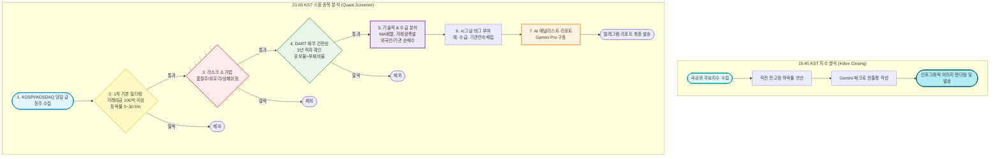

# 📈 K-Stock 퀀트 스윙 스크리너 & 시황 봇 가이드

**매일 한국 주식 시장(KOSPI/KOSDAQ)의 주도주를 자동으로 분석하고 텔레그램으로 리포트를 발송해 주는 봇의 기능, 분석 기준, 그리고 사용법을 정리한 공식 문서입니다.**

---

## 📌 1. 봇 소개 및 주요 기능

이 봇은 매일 자동으로 시장을 분석하여 투자자에게 가장 확률 높은 스윙(단기~중기) 종목을 선별해 주고, 시장의 흐름을 한눈에 파악할 수 있는 인포그래픽을 제공하는 **"나만의 AI 퀀트 애널리스트"**입니다.

### 🌟 2대 핵심 기능
1. **⏰ 15:45 마감 시황 인포그래픽 자동 발송 (지수 분석)**
   - 정규장 마감 직후 국내외 주요 지수의 위치와 변동성을 요약한 시각화 카드를 발송합니다.
2. **⏰ 21:00 스윙 주도주 심층 리포트 발송 (종목 분석)**
   - 엄격한 퀀트 조건, 재무, 수급을 모두 통과한 진짜 주도주만 선별하여 AI 분석 리포트를 발송합니다.

---

## 📊 2. 시장 지수 분석 로직 (15:45 마감 시황)

단순히 지수가 올랐다/내렸다가 아닌, **현재 지수의 진짜 위치**를 파악하기 위해 다각도로 분석합니다.

1. **분석 대상 지수**: KOSPI, KOSDAQ, S&P 500
2. **실시간 종가 및 등락률 추적**: 네이버 금융(국내) 및 야후 파이낸스(해외) API를 통해 당일 마감가와 등락 포인트를 수집합니다.
3. **직전 전고점 대비 하락률 (Swing High Analysis)**: 
   - 과거 5년 치 차트 데이터를 분석하여, 최근 15일 거래일(약 3주) 기준 가장 높았던 **'직전 전고점(Local High)'**을 수학적으로 찾아냅니다.
   - 현재 지수가 이 전고점 대비 얼마나 하락해 있는지(예: `-4.5%`)를 계산하여, 현재 시장이 상승장인지 단기 조정장인지 수치로 직관적으로 보여줍니다.
4. **AI 매크로 한줄평 생성**:
   - 20년 경력의 수석 매크로 애널리스트 페르소나를 부여받은 Gemini AI가 수집된 지수 데이터를 바탕으로 오늘 시장의 국면과 변동성에 대한 **'핵심 통찰 1줄 숏 코멘트'**를 작성합니다.
   - 예: *"현재 시장의 변동성이 지속되고 있으며, 주요 지지선 및 저항선 부근에서의 리스크 관리가 필요한 국면입니다."*

---

## 🔍 3. 스윙 종목 분석 로직 (21:00 주도주 스크리너)

봇이 종목을 선별하는 과정은 매우 까다롭고 체계적입니다. 위험한 주식을 걸러내고, 진짜 돈이 몰리는 주식만 남기는 5단계 필터링 과정을 거칩니다.



### 🔎 종목 스크리닝 세부 기준

1. **기본 퀀트 필터링 (거래대금 & 수익률)**
   - **등락률**: 당일 **5% ~ 30.5%** 상승한 종목 (초기 상승부터 상한가까지 포착)
   - **거래대금**: 당일 거래대금 **200억 원 이상** (유동성이 풍부하여 매매가 쉬운 종목만 대상)

2. **리스크 소거법 (위험 종목 완벽 차단)**
   - **품절주 차단**: 최근 20일 평균 거래량이 10만 주 미만인 소외주 제외
   - **위꼬리 차단**: 장중 최고가는 25% 이상 급등했으나, 종가가 10% 미만으로 크게 하락한 종목 제외 (차익 실현 매물 폭탄 회피)
   - **상폐/관리 종목 차단**: 최신 부채비율이 500%를 초과하는 극도 위험군 제외

3. **DART 재무 건전성 검증**
   - 3년 연속 당기순이익 적자 기업 제외
   - 3개년 연속 **"유보율 > 부채비율"** 조건을 충족하는 재무 튼튼 기업만 통과

4. **기술적 추세 및 수급 분석 (핵심 시그널)**
   - **기술적 지표**: 1000일 장기 이평선 위치, 5-20-60일 단기 이평선 정배열 여부, 20일 평균 대비 거래량 폭발 비율 측정
   - **수급 지표**: KIS(한국투자증권) API를 통해 외국인/기관의 양매수, 혹은 연속 매집 여부 파악

5. **AI 리포트 생성 및 태깅**
   - 통과한 종목에 직관적인 시그널 태그 부착 (예: `[수급: 기관 연속매집] [기술적: 거래량폭발+정배열]`)
   - 차트와 뉴스를 종합하여 매수/매도/손절 전략 텍스트 생성

---

## 🛠️ 4. 봇 사용 방법 (순서대로 따라 하기)

처음 봇을 구동하는 관리자를 위한 세팅 및 실행 가이드입니다.

### 1단계: API 키 준비 및 `.env` 설정
봇이 외부 증권 데이터와 AI, 텔레그램을 사용하기 위해 인증키가 필요합니다.
프로젝트 최상단 폴더에 `.env` 파일을 생성하고 아래 내용을 채워 넣습니다.

```ini
# 한국투자증권(KIS) API 키 (수급 및 차트 데이터)
KIS_APP_KEY=발급받은_키
KIS_APP_SECRET=발급받은_시크릿키
KIS_ENV=PROD

# DART API 키 (기업 재무제표 확인)
DART_API_KEY=발급받은_키

# Google Gemini API 키 (AI 리포트 작성)
GEMINI_API_KEY=발급받은_키

# 텔레그램 봇 토큰 및 받을 채팅방 ID
TELEGRAM_BOT_TOKEN=봇파더에게_받은_토큰
TELEGRAM_CHAT_ID=내_채팅방_ID
```
> 💡 *팁: 내 텔레그램 채팅방 ID를 모르겠다면 `python get_chat_id.py` 스크립트를 실행하여 쉽게 찾을 수 있습니다.*

### 2단계: 필수 프로그램 패키지 설치
터미널(명령 프롬프트)을 열고 폴더로 이동한 뒤, 봇 구동에 필요한 파이썬 라이브러리와 브라우저 환경을 설치합니다.

```bash
# 1. 파이썬 라이브러리 설치
pip install -r requirements.txt

# 2. 인포그래픽 이미지 생성을 위한 브라우저 설치
python -m playwright install chromium
```

### 3단계: 봇 실행하기

봇은 용도에 따라 두 가지 방식으로 실행할 수 있습니다.

#### A. ⏰ 자동 스케줄러 모드 (추천)
컴퓨터나 서버를 켜두면 매일 정해진 시간에 스스로 알아서 동작합니다.
```bash
python main.py
```
- **오후 3시 45분**: 자동으로 지수 마감 인포그래픽을 텔레그램으로 보냅니다.
- **오후 9시 00분**: 스윙 종목 분석 리포트와 분석 원본 엑셀(CSV) 파일을 텔레그램으로 보냅니다.

#### B. ⚡ 수동 즉시 실행 모드 (테스트용)
기다리지 않고 지금 당장 결과물을 받아보고 싶을 때 사용합니다.
- **스윙 종목 분석 당장 실행하기**:
  ```bash
  python main.py --now
  ```
- **마감 지수 인포그래픽 당장 실행하기**:
  ```bash
  python main.py --now-index
  ```

---

## 📱 5. 최종 결과물 예시 (텔레그램 화면)

봇이 정상적으로 작동하면 매일 저녁 여러분의 텔레그램으로 아래와 같은 메세지가 도착합니다.

> 📊 **[오후 3시 45분 국내외 주요 지수 마감 정산]**
> | 지수명 | 당일 종가 (전일대비) | 직전 전고점 대비 |
> |---|---|---|
> | **KOSPI** | 2,750.12 (▲15.20pt, +0.55%) | -2.1% |
> | **KOSDAQ** | 860.30 (▼5.10pt, -0.60%) | -5.4% |
> 
> 💡 **매크로 한줄평**
> - KOSPI는 반도체 대형주 중심의 강세로 반등했으나, KOSDAQ은 2차전지 약세로 하락하며 차별화 장세가 이어지고 있습니다.

> 🚀 **[오후 9시 스윙 주도주 브리핑]**
> 
> 🏆 **오늘의 TOP 스윙 추천주**
> ■ 종목명: **삼성전자 (005930)** [KOSPI] **[수급: 외인기관 양매수] [기술적: 거래량폭발+정배열]**
> - 주도 테마: 온디바이스 AI, 반도체
> - 당일 등락률: +6.50% | 거래대금: 8,500억 원
> - 💰 예상 매수가: 81,000원 부근 (단기 눌림목 노림)
> - 🎯 목표 매도가: 88,000원 이상 익절
> - 🛑 손절가: 78,000원 이탈 시 손절
> - 💡 추천 사유: 최근 외국인 3일 연속 대량 매집 포착 및 60일선 돌파 상승 파동 시작.

---

## 📁 6. 프로젝트 구조

*   `main.py`: 파이프라인 진입점 (스케줄러 및 CLI 모드 제어).
*   `config.py`: 환경 변수 로드 및 설정 검증.
*   `scraper.py`: DART, 네이버, 구글 뉴스 등 웹 및 API 스크래핑 엔진.
*   `quant_filter.py`: 1차 수치/이평선 필터 및 DART 재무 필터 실행부.
*   `index_closing.py`: 15:45 마감 시황 지수 분석 및 매크로 한줄평 생성부.
*   `infographic_generator.py`: Playwright 및 HTML 템플릿 기반 인포그래픽 이미지 렌더링.
*   `report_generator.py`: Gemini API 연동 및 로컬 분석 보고서 컴파일.
*   `notifier.py`: 텔레그램 메시지 포맷팅 및 분할 발송 로직.
*   `get_chat_id.py`: 텔레그램 연동 도우미 스크립트.
*   `requirements.txt`: 의존 패키지 목록.
*   `.gitignore`: 업로드 방지용 설정 파일.
